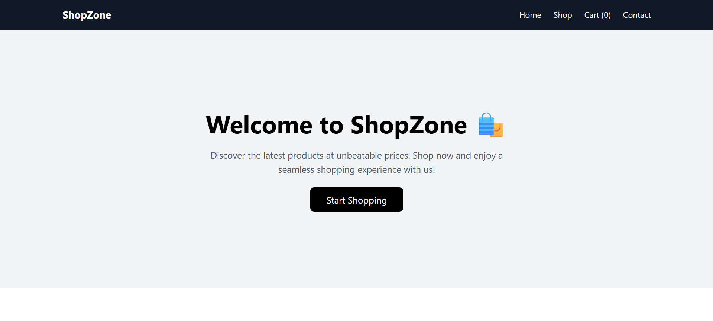
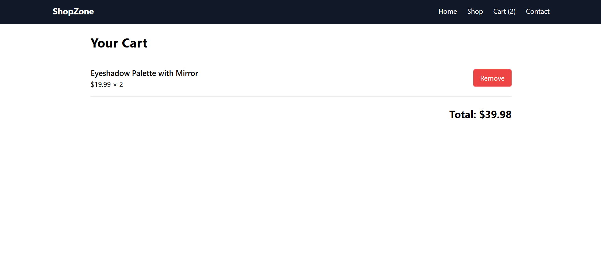

# 🛍️ ShopZone – E-Commerce SPA

## 📸 Project Preview
### User Interface



---

## 🌐 Live Demo:
👉 [https://shopzone-tau.vercel.app/](https://shopzone-tau.vercel.app/)

---

A modern E-Commerce Single Page Application (SPA) built using React, React Router, and Context API.
This project demonstrates real-world frontend architecture including:
- Client-side routing
- Dynamic product pages
- Global state management
- Cart functionality
- Responsive UI design

---

## 🚀 Features

### ✅ Level 1 – Routing & Dynamic Pages
- Multi-page SPA using React Router
- Persistent Navbar across all routes
- Product listing fetched from API
- Dynamic route: `/product/:id`
- Loading state handling
- Clean, responsive product grid

### ✅ Level 2 – Global Cart System (Context API)
- Global state management using Context API
- **Add to Cart** functionality
- **Quantity handling** (prevents duplicate items)
- Dynamic Navbar cart badge
- **Cart page with:**
  - Item listing
  - Remove functionality
  - Total price calculation
  - Empty cart state handling

### ✅ UI Enhancements
- Clean homepage with CTA section
- Professional contact page with:
  - Clickable phone number (`tel:`)
  - Clickable email (`mailto:`)
- Fully responsive layout using Tailwind CSS
- Clean spacing, typography, and hover effects

---

## 🧠 Key Design Decisions
- **SPA Architecture**: Ensures smooth navigation without reload.
- **Dynamic Routing**: Handles product-specific URLs correctly.
- **Context API**: Eliminates prop drilling and manages cart globally.
- **API Separation**: API logic separated into `services/api.js`.
- **Reusable Components**: `ProductCard` and `Navbar` designed for scalability.
- **Vercel Rewrite Configuration**: Ensures SPA routes work correctly on refresh.

---

## 📂 Project Structure
```text
shopzone/
│
├── src/
│   ├── assets/                 # Screenshots for README
│   │   └── ui.png
│   ├── components/
│   │   ├── Navbar.jsx
│   │   └── ProductCard.jsx
│   ├── context/
│   │   └── CartContext.jsx
│   ├── pages/
│   │   ├── Home.jsx
│   │   ├── Shop.jsx
│   │   ├── ProductDetails.jsx
│   │   ├── Cart.jsx
│   │   └── Contact.jsx
│   ├── services/
│   │   └── api.js
│   ├── App.jsx
│   └── main.jsx
│
├── index.html
├── package.json
├── tailwind.config.js
├── postcss.config.js
├── vercel.json
├── README.md
└── prompts.md
```

---

## 🛠️ Technologies Used
- **Frontend Framework**: React (Vite)
- **Routing**: React Router DOM (v7)
- **State Management**: Context API
- **Styling**: Tailwind CSS
- **API Source**: [DummyJSON Products API](https://dummyjson.com/products)
- **Deployment**: Vercel

---

## 🌐 API Used
Products fetched from: [https://dummyjson.com/products](https://dummyjson.com/products)
Used for:
- Product listing
- Dynamic product details

---

## 🧪 How to Run Locally

1️⃣ **Clone the repository:**
```bash
git clone <your-repo-url>
cd shopzone
```

2️⃣ **Install dependencies:**
```bash
npm install
```

3️⃣ **Start development server:**
```bash
npm run dev
```

App runs at: `http://localhost:5173`

---

## 🚀 Deployment
Deployed on Vercel with SPA routing rewrite configuration in `vercel.json`:
```json
{
  "rewrites": [
    { "source": "/(.*)", "destination": "/" }
  ]
}
```

**Live URL:**  
👉 [https://shopzone-tau.vercel.app/](https://shopzone-tau.vercel.app/)

---

## 🤖 AI Assistance Disclaimer
AI tools were used for:
- Understanding SPA architecture
- Structuring Context API logic
- Debugging Tailwind & CLI issues
- Improving folder structure and UI decisions
- Writing professional documentation

All implementation decisions were reasoned, tested, and refined manually. Detailed prompt usage is documented in [`prompts.md`](prompts.md).

---

## 👨‍💻 Author
**Krishna Kumar**  
Frontend Developer Intern – Prodesk IT
