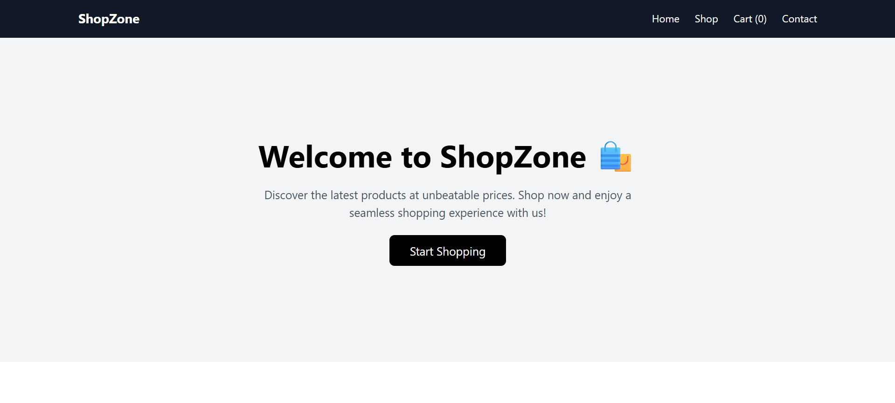
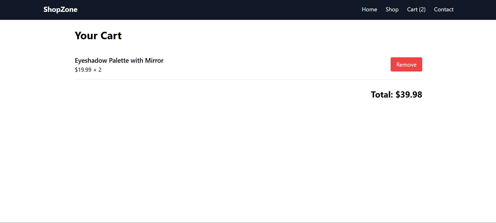

# 🛍️ ShopZone – Scalable E-Commerce SPA (Redux Powered)

## 📸 Project Preview
### User Interface




**🌐 Live Demo:**
👉 [https://shopzone-tau.vercel.app/](https://shopzone-tau.vercel.app/)

A modern and scalable E-Commerce Single Page Application (SPA) built using React, Redux Toolkit, and React Router.

This project demonstrates real-world frontend engineering practices including:
- Scalable global state management using Redux Toolkit
- Dynamic routing and API integration
- Performance optimization techniques
- Persistent state using localStorage
- Clean and responsive UI design

---

## 🚀 Features

### ✅ Level 1 – Redux State Management (Upgrade)
- Migrated from Context API → Redux Toolkit
- Centralized global store for better scalability
- Implemented `cartSlice` with:
  - Add to Cart
  - Remove Item
  - Quantity Management
- Replaced prop drilling with `useSelector` & `useDispatch`
- Global cart state accessible across all components

### 🔍 Level 2 – Advanced Filtering System
- Global filter state using Redux
- Category-based filtering
- Price range filtering (slider)
- Real-time product updates based on filters
- Clean separation of UI and filtering logic

### ⚡ Level 3 – Performance Optimization
- Optimized product filtering using `useMemo`
- Prevented unnecessary re-renders
- Improved performance for large datasets
- Applied efficient state-driven rendering patterns

### 🌙 Level 3 – Global Theme System
- Implemented Dark/Light mode using Redux
- Global theme state (`themeSlice`)
- Toggle button in Navbar
- Instant UI updates across entire app

### 💾 Level 3 – Persistent Cart (localStorage)
- Cart state persists across page reloads
- Redux state synchronized with localStorage
- Real-world user experience improvement

### 🧭 Routing & Core Features
- Multi-page SPA using React Router
- Dynamic routing: `/product/:id`
- Product details page with API data
- Persistent Navbar across all pages
- Contact page with functional UI
- Cart page with total price calculation

### 🎨 UI & UX Enhancements
- Responsive design using Tailwind CSS
- Clean homepage with CTA section
- Professional layout and spacing
- Interactive UI with smooth updates
- Dark/Light mode support

---

## 🧠 Key Engineering Decisions

- **Redux over Context API** → Better scalability and maintainability
- **Global State Architecture** → Clean separation of concerns
- **Memoization** → Prevent unnecessary computations
- **Persistent Storage** → Improves user experience
- **Component Reusability** → Scalable UI structure
- **API Abstraction** → Clean separation of data fetching logic

---

## 📂 Updated Project Structure
```text
shopzone/
│
├── src/
│   ├── assets/
│   ├── components/
│   │   ├── Navbar.jsx
│   │   ├── ProductCard.jsx
│   │   └── FilterBar.jsx
│   │
│   ├── redux/
│   │   ├── store.js
│   │   ├── cartSlice.js
│   │   ├── filterSlice.js
│   │   └── themeSlice.js
│   │
│   ├── pages/
│   │   ├── Home.jsx
│   │   ├── Shop.jsx
│   │   ├── ProductDetails.jsx
│   │   ├── Cart.jsx
│   │   └── Contact.jsx
│   │
│   ├── services/
│   │   └── api.js
│   │
│   ├── App.jsx
│   └── main.jsx
│
├── index.html
├── package.json
├── tailwind.config.js
├── postcss.config.js
├── vercel.json
├── README.md
└── prompts.md
```

---

## 🛠️ Technologies Used
- **Frontend:** React (Vite)
- **State Management:** Redux Toolkit
- **Routing:** React Router DOM
- **Styling:** Tailwind CSS
- **API:** [https://dummyjson.com/products](https://dummyjson.com/products)
- **Deployment:** Vercel

---

## 🌐 API Used
Products fetched from: 👉 [https://dummyjson.com/products](https://dummyjson.com/products)

**Used for:**
- Product listing
- Dynamic product details

---

## 🧪 How to Run Locally

1️⃣ **Clone the repository:**
```bash
git clone <your-repo-url>
cd shopzone
```

2️⃣ **Install dependencies:**
```bash
npm install
```

3️⃣ **Start development server:**
```bash
npm run dev
```

App runs at: 👉 [http://localhost:5173](http://localhost:5173)

---

## 🚀 Deployment
Deployed on Vercel with SPA routing support:

```json
{
  "rewrites": [
    { "source": "/(.*)", "destination": "/" }
  ]
}
```

---

## 🤖 AI Assistance Disclaimer

AI tools were used for:
- Migrating Context API → Redux Toolkit
- Designing global state architecture
- Implementing filtering and theme system
- Debugging UI and state issues
- Optimizing performance
- Structuring project and documentation

All implementations were understood, tested, and refined manually.
Detailed prompt usage is documented in `prompts.md`.

---

## 👨‍💻 Author

**Krishna Kumar**  
Frontend Developer Intern – Prodesk IT
